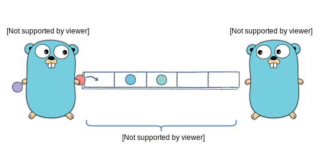

<h1 align="center">
  <br/>
  Superchan
</h1>
<p align="center">Superchan is the same chan but generic and with rate calculator, capable of monitoring input and output data transmission rate.</p>
<p align="center">
<a href="https://pkg.go.dev/github.com/mehditeymorian/superchan?tab=doc"target="_blank">
    
</a>&nbsp;

</p>


# Installation
```shell
go get github.com/mehditeymorian/superchan
```


# Usage
```Go
// Create a new Superchan
c := superchan.New[type](channelSize)

// send data into the channel
c.Send(n)

// receive data from the channel
c.Receive()

// monitor rates
log.Printf("buffer: %d in: %d/s out: %d/s\n", c.BufferedSize(), c.InputRate(), c.OutputRate())
```